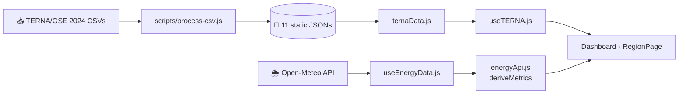

> 🇮🇹 [**Italiano**](./README.md) · 🇬🇧 **English**

<div align="center">

# 🌱 **GreenPulse Italia**

**Italian energy dashboard** — generation, capacity, CO₂ emissions and electricity demand for all **20 regions**, with live weather from Open-Meteo.


**React 19** · **Vite 8** · **Tailwind CSS 4** · **React Router v7** · **Zustand** · **React Hook Form** · **Recharts**


</div>

---

## ✨ Features

| | |
|---|---|
| 🗺️ **All 20 regions** selectable, each with its **own real TERNA/GSE 2024 data** | 📊 24h charts: solar irradiance, wind, estimated CO₂, national time series |
| 🌱 **Live green quota**: renewable potential computed in real time from Open-Meteo | ☀️ **Live irradiance and wind** for every regional capital (Open-Meteo) |
| 🌋 **Plants by source** (hydro, solar, wind, geothermal, thermal…) by region and province | 🏭 **CO₂ emissions and fuels**, electricity demand and YoY per region |
| 🌙 **Light/dark theme** and demo login | ⚡ **CO₂ avoided** estimated in Mt/year from renewable capacity |

---

## 🧭 Pages

| Route | Description |
|---|---|
| `/` | Home with hero and overview |
| `/login` | Simulated login (any valid email + password ≥ 4 characters) |
| `/dashboard` | Live data + 24h charts + national summary and history |
| `/regioni/:id` | Region detail: plants, generation mix, capacity, emissions, provinces |
| `/about` | Tech stack and data sources |

---

## ⚡ Quick start

```bash
npm install
npm run dev        # http://localhost:5173
npm run build      # production → dist/
npm test           # Vitest tests
npm run lint       # ESLint
```

> 🔑 Demo credentials: **`test@test.it`** / **`1234`**

---

## 📐 Units and energy conversions

The **data sources** speak different units: TERNA is a yearly aggregation, Open-Meteo is an instantaneous potential.

| Quantity | Unit | Where | Origin |
|---|---|---|---|
| Installed capacity | **MW** | "Capacity" card (dashboard/region) | TERNA dataset `potenzaEfficiente*` |
| Generation / demand | **GWh** | energy mix, demand | `produzione*`, `domandaTotaleRegionale` datasets |
| Emissions (dataset) | **Mt** | "Fuels and emissions" | CSV "mln di tonnellate" |
| CO₂ avoided | **t → Mt** | "Climate impact" badge | computed |
| Solar irradiance | **W/m²** | live card, solar curves | Open-Meteo `shortwave_radiation` |
| Wind | **km/h** | live card, 24h wind | Open-Meteo `wind_speed_10m` |
| Instantaneous CO₂ intensity | **g/kWh** | "Estimated CO₂" card | computed from green quota |

### Main conversions (`src/data/regions.js` → `getRegionStats()`)

```js
CO₂ avoided (t/year) = renewableMW  ×  8760 h × 0.22 × 0.4
```

- **`× 8760`** → converts **MW into MWh/year** (365 days × 24 h: the energy *if* the plant ran at 100%).
- **`× 0.22`** → average capacity factor of renewables (≈22% of the theoretical maximum).
- **`× 0.4`** → tonnes of CO₂ avoided per **MWh** generated (0.4 t/MWh).

The result in tonnes is shown in the UI divided by **10⁶ → Mt** (1 Mt = 10⁶ t):

```js
Mt  = CO₂_t / 1_000_000        // e.g. Lombardy ≈ 11 047 MW × 8760 × 0.22 × 0.4 → ≈ 8.5 Mt/year
```

> **Example with real 2024 data:** Lombardy ≈ **11 047 MW** of renewables → ≈ **8.5 Mt of CO₂/year** avoided.

Reverse conversion (generation → capacity, thermal, `ternaData.js`):
`MW ≈ GWh / 5 500 h` — 5 500 hours are the *equivalent full-load hours* (reciprocal of the capacity factor).

---

## 🌱 Business logic: from Open-Meteo to the **Green Quota**

Everything lives in `src/services/energyApi.js` (`deriveMetrics()`). Inputs: instantaneous irradiance and wind of the region's capital.

### 1. Raw data

```js
solarNow = shortwave_radiation      // W/m²  (instantaneous)
windNow  = wind_speed_10m          // km/h  (instantaneous)
```

### 2. Potential as a percentage (hard-coded thresholds)

```js
solarPct = min(100, solarNow / 800 × 100)   // 800 W/m² = midday clear-sky peak
windPct  = min(100, windNow  / 50  × 100)   // 50 km/h = "full wind" threshold
```

### 3. Green Quota of the renewable mix — the key calculation

```js
renewablePct = round( solarPct × 0.6  +  windPct × 0.4 )
```

**60% solar / 40% wind weighting** → shown in the "Green Quota · %" card on the dashboard.

| `renewablePct` | Bar / color |
|---|---|
| ≥ 60 | 🟢 green |
| 30 – 59 | 🟡 amber |
| < 30 | 🔴 red |

### 4. Instantaneous CO₂ estimate

```js
co2Now (g/kWh) = 450 − renewablePct × 2.7
```

- **450 g/kWh** = reference carbon intensity of the fossil mix;
- **2.7 g/kWh** = decrease for each percentage point of green quota (at 100% → **180 g/kWh**);
- 24h hourly curve: `450 − solarPct×2.0 − windPct×0.7`.

> ⚠️ The live green quota is an **instantaneous weather-based potential**, *different* from the regional renewable share
> computed on **2024 installed capacity** (`renewablePct = round(renewableMW / totalMW × 100)`),
> which is static and based on the TERNA datasets. The constants (800, 50, 0.6/0.4, 450, 2.7, …) are **project estimates**, not physical measurements.

---

## 🔁 Data flow



---

## 📁 Structure

```
src/
├── pages/        # Route-level components (Dashboard, RegionPage, Home…)
├── components/   # Reusable UI (+ charts/)
├── hooks/        # useEnergyData (Open-Meteo), useTERNA (real datasets)
├── services/     # energyApi (Open-Meteo), ternaData (JSON loader + cache)
├── store/        # Zustand stores (app, auth)
├── data/         # Cities, 20 regions, TERNA JSON datasets
└── test/         # Vitest (services, stores, components, region coverage)
```

## 🛠️ Scripts

- `node scripts/process-csv.js` — regenerates the JSONs from the TERNA CSVs (handles Italian numeric format)
- `python scripts/build_region_plants.py [csv_path]` — regenerates the plants from the ATLASOLE CSV

> Per-plant capacity data are estimates based on public GSE/TERNA sources, not point-exact ATLASOLE figures.

## 🚀 Deploy

**Vercel** — automatic build on push to `main`, output in `dist/`.

## 📜 License

🌍💚 Copyright (c) 2026 Di Ruscio Cosimo Francesco. All rights reserved. See [LICENSE](./LICENSE). 🌍💚