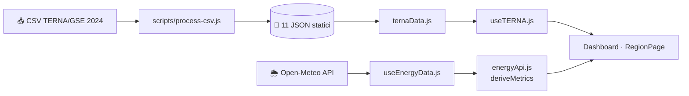

> 🇮🇹 **Italiano** · 🇬🇧 [**English**](./README.en.md)

<div align="center">

# 🌱 **GreenPulse Italia**

**Dashboard energetica italiana** — produzione, capacità, emissioni CO₂ e domanda elettrica per tutte e **20 le regioni**, con meteo live da Open-Meteo.


**React 19** · **Vite 8** · **Tailwind CSS 4** · **React Router v7** · **Zustand** · **React Hook Form** · **Recharts**


</div>

---

## ✨ Caratteristiche

| | |
|---|---|
| 🗺️ **Tutte le 20 regioni** selezionabili con i **propri dati reali** TERNA/GSE 2024 | 📊 Grafici 24h: irraggiamento solare, vento, CO₂ stimata, serie storica nazionale |
| 🌱 **Quota verde live**: potenziale rinnovabile calcolato in tempo reale da Open-Meteo | ☀️ **Irraggiamento e vento live** per il capoluogo di ogni regione (Open-Meteo) |
| 🌋 **Impianti per fonte** (idrico, fotovoltaico, eolico, geotermico, termoelettrico…) per regione e provincia | 🏭 **Emissioni CO₂ e combustibili**, domanda elettrica e YoY per regione |
| 🌙 **Tema chiaro/scuro** e login demo | ⚡ **CO₂ evitata** stimata in Mt/anno da capacità rinnovabile |

---

## 🧭 Pagine

| Route | Descrizione |
|---|---|
| `/` | Home con hero e panoramica |
| `/login` | Login simulato (qualsiasi email valida + password ≥ 4 caratteri) |
| `/dashboard` | Dati live + grafici 24h + riepilogo nazionale e storico |
| `/regioni/:id` | Dettaglio regione: impianti, mix di produzione, capacità, emissioni, provincia |
| `/about` | Stack tecnologico e fonti dati |

---

## ⚡ Avvio rapido

```bash
npm install
npm run dev        # http://localhost:5173
npm run build      # produzione → dist/
npm test           # test Vitest
npm run lint       # ESLint
```

> 🔑 Credenziali demo: **`test@test.it`** / **`1234`**

---

## 📐 Unità di misura e conversioni energetiche

Le **fonti dati** parlano unità diverse: TERNA è aggregazione annuale, Open-Meteo è potenziale istantaneo.

| Grandezza | Unità | Dove | Origine |
|---|---|---|---|
| Capacità installata | **MW** | card "Capacità" (dashboard/regione) | dataset TERNA `potenzaEfficiente*` |
| Produzione / domanda | **GWh** | mix energetico, domanda | dataset `produzione*`, `domandaTotaleRegionale` |
| Emissioni (dataset) | **Mt** | "Combustibili ed emissioni" | CSV "mln di tonnellate" |
| CO₂ evitata | **t → Mt** | badge "Impatto climatico" | calcolata |
| Irraggiamento solare | **W/m²** | card live, curve solari | Open-Meteo `shortwave_radiation` |
| Vento | **km/h** | card live, vento 24h | Open-Meteo `wind_speed_10m` |
| Intensità CO₂ istantanea | **g/kWh** | card "CO₂ stimata" | calcolata da quota verde |

### Conversioni principali (`src/data/regions.js` → `getRegionStats()`)

```js
CO₂ evitata (t/anno) = renewableMW  ×  8760 h × 0.22 × 0.4
```

- **`× 8760`** → converte **MW in MWh/anno** (365 giorni × 24 h: energia *se* l'impianto produce al 100%).
- **`× 0.22`** → fattore di capacità medio delle rinnovabili (≈22% del massimo teorico).
- **`× 0.4`** → tonnellate di CO₂ evitate per **MWh** prodotto (0,4 t/MWh).

Il risultato in tonnellate viene mostrato in UI diviso per **10⁶ → Mt** (1 Mt = 10⁶ t):

```js
Mt  = CO₂_t / 1_000_000        // es. Lombardia ≈ 11 047 MW × 8760 × 0.22 × 0.4 → ≈ 8,5 Mt/anno
```

> **Esempio con dati reali 2024:** Lombardia ≈ **11 047 MW** rinnovabili → ≈ **8,5 Mt di CO₂/anno** evitate.

Conversione inversa (produzione → capacità, termoelettrico, `ternaData.js`):
`MW ≈ GWh / 5 500 h` — le 5 500 ore sono le *ore-equivalenti* di funzionamento a piena potenza (inverso del fattore di capacità).

---

## 🌱 Business logic: da Open-Meteo alla **Quota Verde**

Tutto in `src/services/energyApi.js` (`deriveMetrics()`). Input: irraggiamento e vento istantanei del capoluogo.

### 1. Dati raw

```js
solarNow = shortwave_radiation      // W/m²  (istantaneo)
windNow  = wind_speed_10m          // km/h  (istantaneo)
```

### 2. Potenziale in percentuale (soglie hard-coded)

```js
solarPct = min(100, solarNow / 800 × 100)   // 800 W/m² = picco cielo sereno a mezzogiorno
windPct  = min(100, windNow  / 50  × 100)   // 50 km/h = soglia "vento pieno"
```

### 3. Quota Verde del mix rinnovabile — il calcolo chiave

```js
renewablePct = round( solarPct × 0.6  +  windPct × 0.4 )
```

**Ponderazione 60% solare / 40% eolico** → mostrata nella card "Quota Verde · %" della dashboard.

| `renewablePct` | Barra / colore |
|---|---|
| ≥ 60 | 🟢 verde |
| 30 – 59 | 🟡 ambra |
| < 30 | 🔴 rosso |

### 4. Stima CO₂ istantanea

```js
co2Now (g/kWh) = 450 − renewablePct × 2.7
```

- **450 g/kWh** = intensità carbonica di riferimento del mix fossile;
- **2,7 g/kWh** = decremento per ogni punto % di quota verde (a 100% → **180 g/kWh**);
- curva oraria 24h: `450 − solarPct×2.0 − windPct×0.7`.

> ⚠️ La quota verde live è un **potenziale meteo istantaneo**, *diverso* dalla quota rinnovabile regionale
> calcolata sulla **capacità installata 2024** (`renewablePct = round(renewableMW / totalMW × 100)`),
> statica e basata sui dataset TERNA. Le costanti (800, 50, 0.6/0.4, 450, 2.7, …) sono **stime di progetto**, non misure fisiche.

---

## 🔁 Flusso dei dati



---

## 📁 Struttura

```
src/
├── pages/        # Route-level components (Dashboard, RegionPage, Home…)
├── components/   # UI riutilizzabili (+ charts/)
├── hooks/        # useEnergyData (Open-Meteo), useTERNA (dataset reali)
├── services/     # energyApi (Open-Meteo), ternaData (loader JSON + cache)
├── store/        # Zustand stores (app, auth)
├── data/         # Città, 20 regioni, dataset JSON TERNA
└── test/         # Vitest (servizi, store, componenti, copertura regioni)
```

## 🛠️ Script

- `node scripts/process-csv.js` — rigenera i JSON dai CSV TERNA (formato numerico italiano gestito)
- `python scripts/build_region_plants.py [csv_path]` — rigenera gli impianti dal CSV ATLASOLE

> I dati di capacità per singolo impianto sono stime basate su fonti pubbliche GSE/TERNA, non puntuali ATLASOLE.

## 🚀 Deploy

**Vercel** — build automatica su push a `main`, output in `dist/`.

## 📜 Licenza

🌍💚 Copyright (c) 2026 Di Ruscio Cosimo Francesco. All rights reserved. Vedi [LICENSE](./LICENSE). 🌍💚